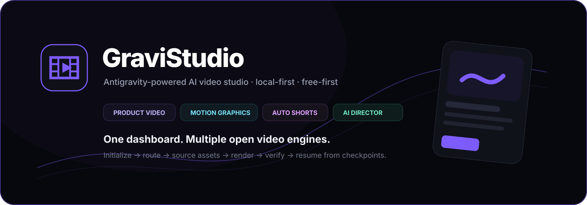
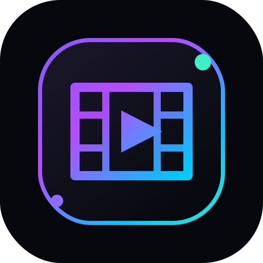
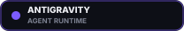
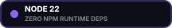
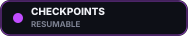
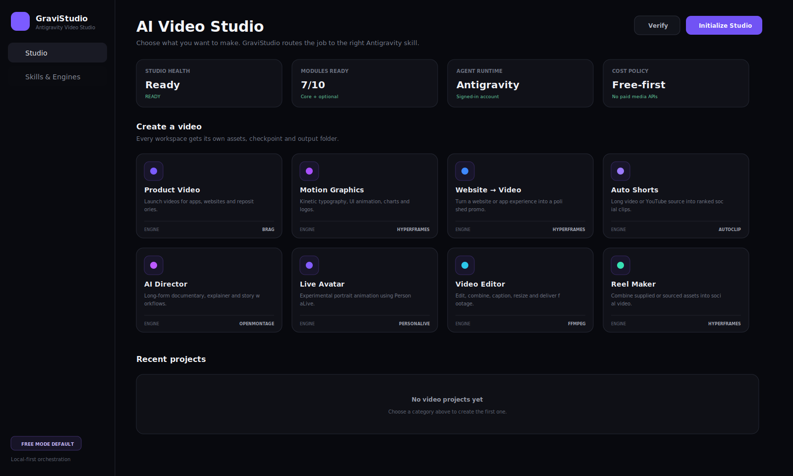
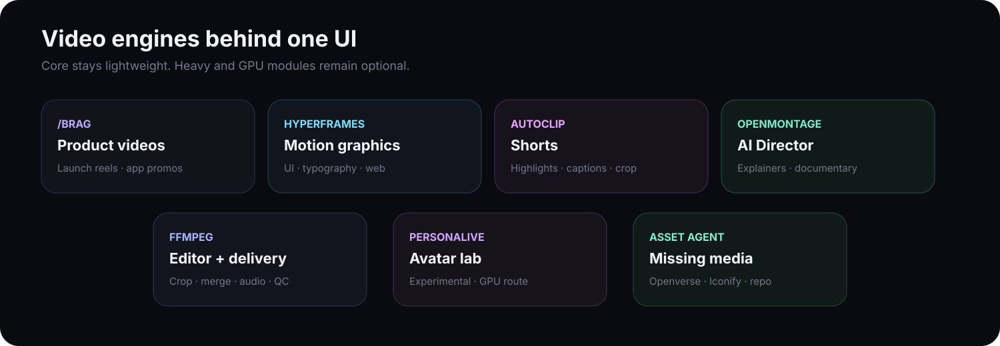
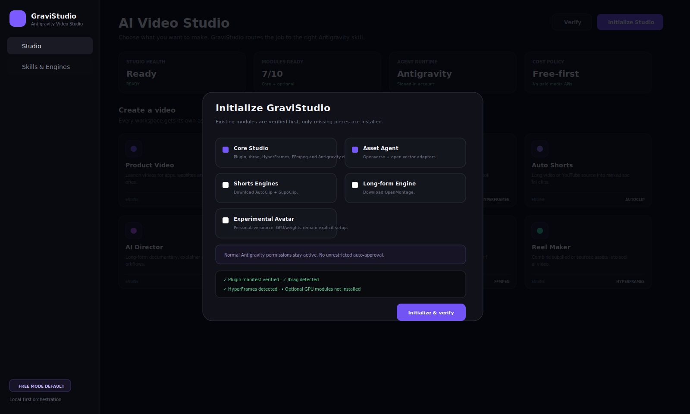
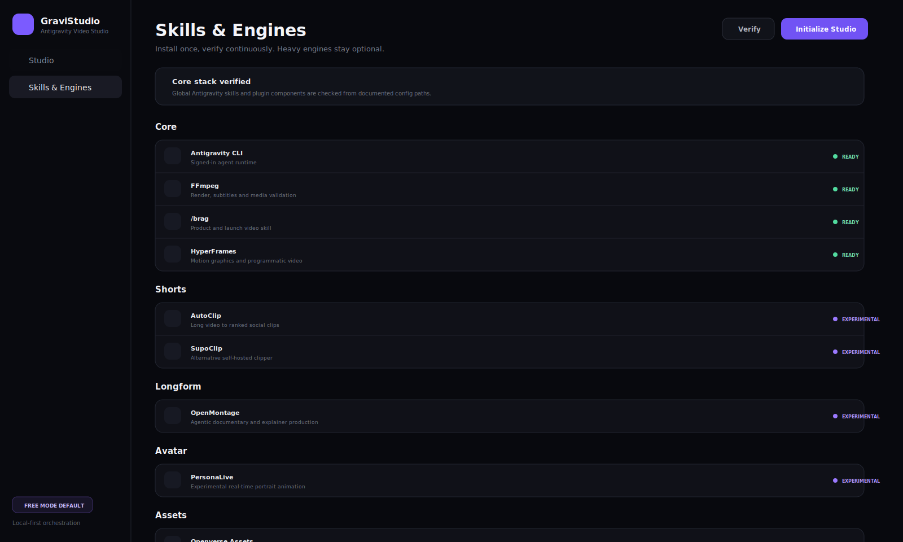
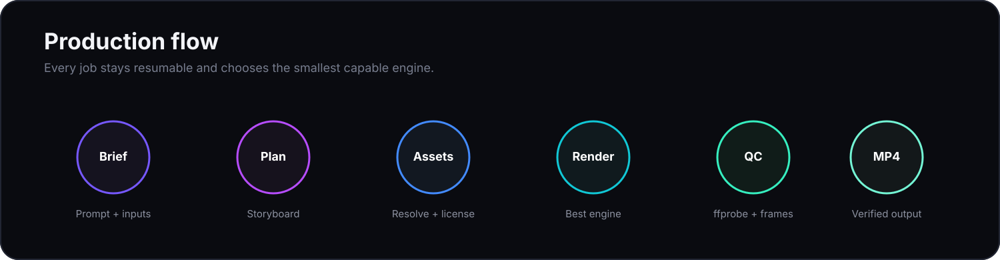

<p align="center">
  
</p>

<p align="center">
  
</p>

<p align="center">
  
  
  
  
  
</p>

<p align="center">
  <strong>One local dashboard for Antigravity-driven video production.</strong><br/>
  Product videos, motion graphics, website promos, shorts, explainers, editing, asset sourcing and experimental avatar workflows — routed to the right open video tool automatically.
</p>

<p align="center">
  <a href="#quick-start"><strong>Quick start</strong></a> ·
  <a href="#studio-workspaces"><strong>Workspaces</strong></a> ·
  <a href="#initialize-once-verify-any-time"><strong>Initialization</strong></a> ·
  <a href="#asset-agent"><strong>Asset Agent</strong></a> ·
  <a href="#downloads"><strong>Prebuilt downloads</strong></a>
</p>

---

## The studio

GraviStudio turns **Google Antigravity into the decision-making layer** and keeps specialist video engines underneath a single interface. You describe the result you want; the studio chooses the smallest capable route, fills missing assets, maintains checkpoints, renders locally where possible, and verifies the final media before calling the job complete.

<p align="center">
  
  <br/><sub>Current dashboard UI preview generated from the repository source.</sub>
</p>

### What makes it different

<table>
<tr>
<td width="25%"><strong>Agent-native</strong><br/><sub>Uses the signed-in Antigravity CLI as the orchestration runtime.</sub></td>
<td width="25%"><strong>Free-first</strong><br/><sub>Prefers local/open tools and refuses paid media routes while Free Mode is enabled.</sub></td>
<td width="25%"><strong>Asset-aware</strong><br/><sub>Can resolve missing visuals from project files, site captures, Openverse and open vectors.</sub></td>
<td width="25%"><strong>Resumable</strong><br/><sub>Every project writes checkpoints so an interrupted agent does not restart completed work.</sub></td>
</tr>
</table>

## Studio workspaces

| Workspace | Best for | Primary route |
| --- | --- | --- |
| **Product Video** | Apps, websites, repositories, launch reels | `/brag` + HyperFrames |
| **Motion Graphics** | Kinetic typography, UI motion, charts, logo animation | HyperFrames |
| **Website → Video** | Product walkthroughs and polished site promos | HyperFrames |
| **Auto Shorts** | Long video / authorized YouTube source → ranked clips | AutoClip / SupoClip |
| **AI Director** | Explainers, documentary-style and long-form productions | OpenMontage |
| **Live Avatar** | Portrait animation experiments | PersonaLive |
| **Video Editor** | Merge, crop, caption, resize, audio and delivery | FFmpeg |
| **Reel Maker** | Mixed supplied or autonomously sourced assets | HyperFrames + FFmpeg |

<p align="center">
  
</p>

## Initialize once, verify any time

The first-launch **Initialize Studio** action is intentionally idempotent. It checks what is already present, installs only missing pieces, then runs a doctor pass and reports each module as **Ready**, **Needs setup**, **Missing**, or **Experimental**.

<p align="center">
  
</p>

Core initialization covers:

- the GraviStudio Antigravity plugin;
- Antigravity CLI discovery;
- FFmpeg / ffprobe discovery;
- `/brag` skill discovery/installation;
- HyperFrames skill installation/update;
- Asset Agent adapters;
- final health verification.

Heavy modules stay opt-in. AutoClip, SupoClip, OpenMontage and PersonaLive are downloaded only when selected; GraviStudio does **not** silently modify CUDA, Conda or system Python environments.

<p align="center">
  
</p>

## Production flow

<p align="center">
  
</p>

Each job follows a stable contract:

```text
requirements → storyboard → assets → composition → render → qc
```

After every completed stage the agent updates:

```text
.gravistudio/checkpoint.json
```

A resumed job reads that checkpoint first and skips completed stages whose inputs have not changed.

## Asset Agent

If the user does not provide enough usable media, GraviStudio does not stop at “please upload an image.” The Asset Agent fills only the missing scene requirements and follows this priority:

```text
user uploads
  ↓
repository / project assets
  ↓
authentic website or app captures
  ↓
Openverse / public-domain / open-license imagery
  ↓
Iconify and other open vectors
  ↓
configured free stock sources
  ↓
already-installed local generation models
```

Every selected asset is expected to be recorded in `.gravistudio/assets.json` with provider, source URL, creator when available, license, dimensions, local path, intended scene and approval state. Watermarked or unclear-license media is rejected.

## Routing architecture

```text
                         GRAVISTUDIO
                             │
                      Local dashboard
                             │
                      Antigravity CLI
                             │
                    /video-studio router
                             │
          ┌──────────────────┼──────────────────┐
          │                  │                  │
       /brag             HyperFrames        AutoClip
          │                  │                  │
          ├──────────── OpenMontage ───── PersonaLive
          │                  │                  │
          └──────────────────┼──────────────────┘
                             │
                         Asset Agent
                             │
                           FFmpeg
                             │
                         /video-qc
                             │
                     verified output.mp4
```

The GraviStudio plugin also includes dedicated **Video Director**, **Asset Curator**, and **Video QC** subagents plus an always-on free-first rule.

## Quick start

### Requirements

Core runtime:

- Google Antigravity CLI (`agy`), signed in once interactively;
- Node.js **22+**;
- Git;
- FFmpeg + ffprobe on `PATH`.

A full FFmpeg build is recommended for caption workflows that rely on H.264/AAC and `libass`.

### Windows

```powershell
./start.ps1
```

### macOS / Linux

```bash
./start.sh
```

Then open:

```text
http://127.0.0.1:47831
```

Click **Initialize Studio** on first launch.

GraviStudio itself has **zero npm runtime dependencies** — the dashboard/API is served directly by Node 22. Video skills and optional engines are installed only when you initialize them.

## Downloads

Ready-to-run repository packages are committed under [`dist/`](dist/):

- [`GraviStudio-v0.1.0-prebuilt.zip`](dist/GraviStudio-v0.1.0-prebuilt.zip) — complete local dashboard + plugin package;
- [`gravistudio-antigravity-plugin-v0.1.0.zip`](dist/gravistudio-antigravity-plugin-v0.1.0.zip) — plugin-only package;
- [`SHA256SUMS.txt`](dist/SHA256SUMS.txt) — package checksums.

The prebuilt archive still expects the core system requirements above; it does **not** bundle third-party engine repositories, model weights, FFmpeg or Antigravity itself.

## Free Mode

Free Mode is enabled by default. While active, the agent rule forbids paid media APIs and paid stock routes unless the user explicitly turns Free Mode off and configures that provider themselves.

It is a workflow policy, not a billing firewall for unrelated third-party accounts. GraviStudio never enables Antigravity's unrestricted permission-bypass mode.

## Permissions and privacy

- Local server binds to `127.0.0.1` only.
- Uploaded project media stays under the local GraviStudio data directory unless a selected workflow explicitly needs another destination.
- GraviStudio does not silently upload private source media to third-party providers.
- Normal Antigravity permissions remain active.
- A blocked headless job records the prerequisite and can resume from its checkpoint after approval.
- Final output is not marked complete until `/video-qc` validates the actual rendered file.

See [`SECURITY.md`](SECURITY.md) for the security model.

## Project layout

```text
GraviStudio/
├── plugin/                     # Antigravity plugin, skills, agents and rules
├── src/
│   ├── core/                   # router, jobs, installer, doctor, storage
│   └── server/                 # dependency-free localhost API + dashboard server
├── web/                        # local dashboard UI
├── scripts/                    # doctor + plugin installer
├── tests/                      # structure/routing tests
├── docs/assets/                # brand assets and README screenshots
├── dist/                       # ready-to-run ZIP packages
├── .github/workflows/ci.yml
├── start.ps1
└── start.sh
```

## Verify the build

```bash
npm run check
npm test
npm run doctor
```

The production baseline has been checked for JavaScript syntax, category routing, plugin structure, checkpoint contracts, local HTTP health, dashboard delivery, raw file upload, job persistence and the missing-Antigravity failure path.

## Local data

By default:

```text
~/.gravistudio/
  jobs/
  projects/
  tools/
  uploads/
```

Set `GRAVISTUDIO_HOME` to move the GraviStudio data directory.

## Third-party engines

GraviStudio does not vendor third-party video repositories. The initializer references their upstream GitHub projects so their own licenses and update paths remain separate.

| Integration | Purpose | Notes |
| --- | --- | --- |
| [`latent-spaces/brag`](https://github.com/latent-spaces/brag) | Product/launch videos | Agent skill |
| [`heygen-com/hyperframes`](https://github.com/heygen-com/hyperframes) | Programmatic motion/video | Agent-oriented render workflows |
| [`artbyjazi/autoclip`](https://github.com/artbyjazi/autoclip) | Long video → shorts | Optional local engine |
| [`FujiwaraChoki/supoclip`](https://github.com/FujiwaraChoki/supoclip) | Alternate clipper | AGPL-3.0 upstream |
| [`n0-space/openmontage`](https://github.com/n0-space/openmontage) | Long-form/agentic production | AGPL-3.0 upstream |
| [`gskfilmmaker/personalive`](https://github.com/gskfilmmaker/personalive) | Portrait animation | Experimental; inspect upstream terms |
| [Openverse](https://openverse.org/) | Open-media discovery | Per-asset licenses vary |
| [Iconify](https://iconify.design/) | Open vector/icon discovery | Icon-set licenses vary |

See [`THIRD_PARTY.md`](THIRD_PARTY.md) before commercial use.

## Development

```bash
npm run dev
```

Dashboard/API:

```text
http://127.0.0.1:47831
```

Useful commands:

```bash
npm run check
npm test
npm run doctor
npm run install:plugin
```

## License

GraviStudio's own source is released under the [MIT License](LICENSE). Optional engines and media assets keep their own upstream licenses.

<p align="center">
  
  <br/>
  <sub>Built as a local-first Antigravity video orchestration layer.</sub>
</p>
